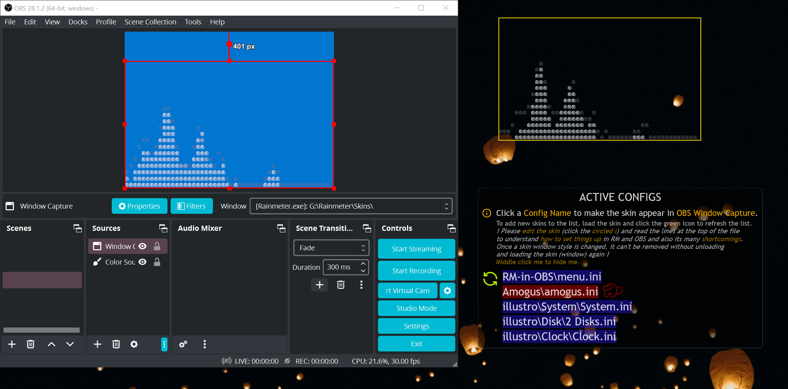

# RM-in-OBS
Removes an Extended Window Style to get Rainmeter Skins into OBS

# Requirements
* **Windows 10** (1903 and up)
* **OBS** (25.0.0 and up)

# Installation
**Get the latest .rmskin from the [Releases](https://github.com/Drgabi18/RM-in-OBS/releases) tab**

# How do I use this?

[Demo video if you can't follow simple text tutorials](https://streamable.com/0j1e5v)

1. Click on the **Skin Config Names** from the list to prepare it for **OBS**, the selection should turn red
2. Go on OBS, create a new **Window Capture**
( If you don't have any other window OBS can attach to, you won't be able to change anything, this is an OBS bug, just open any window, Notepad or calculator should suffice )
3. Select **Capture Method**, change it from _"Automatic"_ to **_"Windows 10 (1903 and up)"_**
4. Select _Window_, chose the Rainmeter window(s) you prepared
5. _(Optional, Recommended)_ Untick Capture Cursor

# Why does this work?
OBS has been coded so Windows™ windows that have the `WS_EX_TOOLWINDOW` Extended Window Style (confusing, don’t ask) don’t appear in the list of windows you can capture when set to _Automatic_, presumably this has been done because windows that use that extended style are usually overlays or windows that assist in other aspects, stuff you probably wouldn’t want to capture.

While set on _Automatic_, the windows will be complete black, this is probably because it uses _BitWit (Win 7)_, which dosen't support capturing windows with this Extended Window Style, _Windows 10_ however does, and it's the only reason the trick works.
Rainmeter uses the `WS_EX_TOOLWINDOW` Extended Window Style to hide its skins from ALT+TAB/WIN+TAB, if you do the commands right now, you will see all the Rainmeter windows you selected in the skin and OBS will be in the Task Switcher.

Pretty cool right?

A side effect of this is that Rainmeter windows will be in other apps for capture too, like Discord.

Anyways, to remove the style from Rainmeter’s windows I used an AHK script, the code pasted below

```ahk
for a, b in A_Args {
WinSet, ExStyle, -0x80, %b%
}
```

I copy pasted it off the AHK Documentation and I didn’t read the rest, I don’t even know what the first `“a”` dose, `“b”` is the important parameter that is parsed though. Because the last parameter on `WinSet` accepts windows titles (the ones when you ALT+TAB, e.g. `menu.ini - Notepad`) and because Rainmeter’s window titles are their file name (because of [these lines of code](https://github.com/rainmeter/rainmeter/blob/master/Library/Skin.cpp#L272-L276)), what this skin does is just execute a bang formatted like `[“ExStyleRemove.exe” “G:\Rainmeter\Skins\RM-in-OBS\menu.ini”]` which AHK executes to remove the Extended Style.

The capturing method that was introduced in Windows 10 is used in Microsoft Teams and several other apps, you can also hide Rainmeter Windows from Share Screen! You need to toggle on WDA_EXCLUDEFROMCAPTURE, however Googling how to do that in AHK lead me to no result and I wouldn't know how to do it anyways.

# Shortcomings
1. DPI Scaling
2. Capture Method Yellow Border (Problem from Microsoft)
3. The style disappears if you restart Rainmeter (unless you make the AHK file portable, read the section below)
4. Because I didn't make the `WinSet` a toggle (because I don't wanna code the toggle, as it's already hard to keep track of skins that may have had the style applies, and because i literally don't know how), I only made the skin remove the Extended Style, to make them no longer be captured by OBS, unload and load the skins to completly kill the process that hosted the window, this can be easily fixed by someone with patience though, which is not me
5. The skin probably dosen't work for people who have Unicode characters in their Windows username, as it uses LUA to generate files, the problem can be solved again by going portable
6. Random Crashes (Problem from OBS, I don't blame them)

# Portable
If you wanna remove the Extended Style of any window when a skin loads, all you need to do is include the bang below in a .ini/skin, copy pasting the line below should do it (if you know what you're doing, put it where you need though)

`OnRefreshAction=["#SKINSPATH#\RM-in-OBS\@Resources\ExStyleRemove.exe" "#CURRENTPATH##CURRENTFILE#"]`

# Other things
The skin is janky if not obvious, are you surprised?

# Credits
* "JSMorley" for his "[ConfigActive](https://forum.rainmeter.net/viewtopic.php?t=28720#p149824)" plugin, which is the main skeleton of the skin
* "icons8.com" for the refresh and note icon

# Version History
* (23 July 2023) **Release Candidate 2**
  - Well I failed my promise...
  - SKIN: Corrected wording around - to make it less obvious I'm [ESL](https://www.urbandictionary.com/define.php?term=ESL)
  - SKIN: Added an Info icon - for people who might not know how to Right Click > Edit skin
  - SKIN: Added `[ErrorString]` - which appears if the `Initialize()` function fails
  - LUA: Improved the code a bit, `GenerateConfig()` is the same but I made the `ins()` helper function for the lines that should be added, explanation inside
  - LUA: Finally made `GetWidth()` decent, previously it just got the meter with the longest width, now it gets the meter with the longest `X + W` value and sets `[HackyPadding]`'s X to that, so the skin now has a Padding of 12 all around
* (Christmas 2022) **I hope Release Candidate without any other new version**
  - Initial release

# License
`Free for Personal Use, Free to Distribute, Do not claim Ownership.`

I couldn't find what I want on Google, so all you want to do with my work is free but if you claim ownership and try to get money of it, you're in hot water buddy, I don't want blood on my hands any time soon
